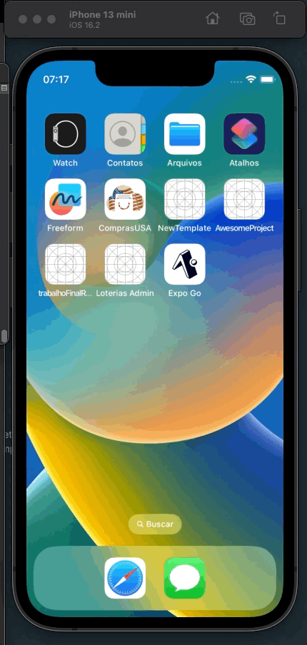

## 📱 Projeto

Este projeto implementa uma busca de perfil do GitHub, consumindo a API oficial da plataforma apenas com o protocolo http GET, os demais protocolos são restritos.

| Android | iOS |
| --- | ---|
| https://user-images.githubusercontent.com/26841238/230651884-55c84ade-93cb-4893-9747-f28baada59c5.mov |  |

## 🧑‍💻 Técnicas e Tecnologias

As técnicas e tecnologias utilizadas no projeto são:

- `Expo`: tecnologia para simplificar o ambiente de desenvolvimento
- `Axios`: para fazer requisições
- `Componentes React Native`: componentes já existentes básicos da tecnologia para compor a tela
  - `Text`: componente para exibir textos
  - `View`: container para blocos de componentes
  - `ScrollView`: container para blocos de componentes com barra de rolagem
  - `Image`: componente para exibir imagens
  - `TouchableOpacity`: componente para criar áreas clicáveis
  - `Flat List`: suporte a fontes do google via Expo
- `Componentes customizados`: criação e utilização de componentes customizados
- `Suporte a telas`: não permitir que conteúdos estejam sob a *StatusBar* (barra superior nativa) ou barra de gestos do iPhone
- `StyleSheet`: estilização básica de componentes
- `Dimensions`: captura de dados das dimenções da tela

## 📲 Executando o projeto

### ✔️ Pré-requisitos

Para conseguir seguir este README e rodar o projeto você pode precisar dos seguintes itens:
- Git para clonar o projeto e acessar as branches. Você pode instalar [aqui](https://git-scm.com/downloads);
- Node para podermos rodar `expo` e `npm`. Você pode instala-lo [aqui](https://nodejs.org/en/);
- Um celular Android ou iOS com o aplicativo Expo instalado, ou então algum simulador Android ou iOS no computador;

Se quiser testar as instalações, rodar os comandos abaixo separadamente deve mostrar as respectivas versões.

```
git --version
node --version
npm --version
```

Então com o `npm` instalado podemos instalar o `expo` e checar a versão:
```
npm install --global expo-cli
expo --version
```

### 🐙 Clonando o projeto

Para ter acesso aos arquivos do projeto você pode clonar usando o seguinte comando:

```
git clone https://github.com/SamuelDevMobile/ReactNative_AppHub.git
```

### ▶️ Rodando o Projeto

Agora que já tem a pasta do projeto na sua máquina, dentro dela instale as dependências:
```
npm install
```

Então podemos rodar o projeto:
```
npm start
```

Uma guia no navegador irá abrir, geralmente [neste endereço](http://localhost:19002/).
Caso estiver com o celular, **escaneie o QR code com o aplicativo do Expo** ou a câmera.
Se seu celular estiver em outra rede diferente do computador, troque a "CONNECTION" para "Tunnel", que o app será transmitido via internet.
Se tiver um simulador, clique na opção do sistema operacional do seu simulador no menu esquerdo.

Pronto, agora o app você deve ver o app rodando.
